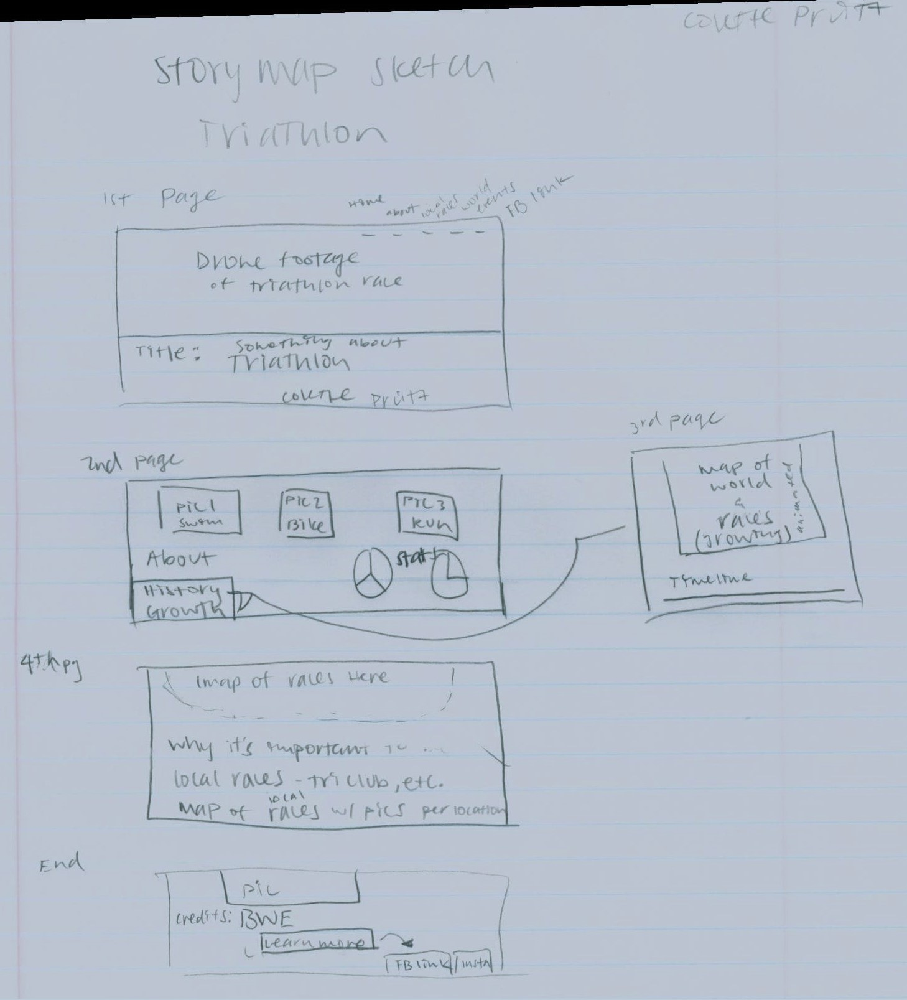
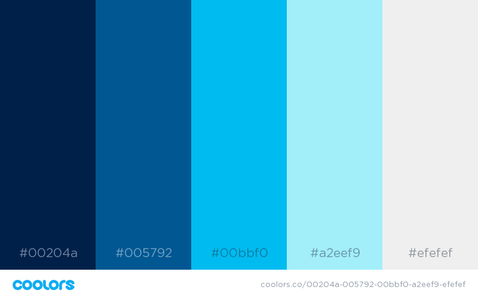

# Triathlon

### Project Description
This storymap uses D3, Leaflet, and Bootstrap. Many images and a video came from multiple sources. And many links to various websites were used to put together a presentation to show the sport of triathlon and the impact it has had on my life and how I became more involved.

### Project Goal
This project is an attempt at show casing the variety that the sport of triathlon has to offer. There are more race options than just Ironman, and it's easier to race than most people think. It's an inclusive community that is competitive but also shows tremendous amounts of sportsmanship and "good vibes". There are also various sizes of race events from local to large scale, so that's what I try to convey through this storymap. 

### Technical Summary

### Sketch

### Design Scheme

### Data Source
| Slide # | Object | Source |
| ------- | ------ | ------ |  
| Opening | Video | [Best in the West Events](http://www.bestinthewesttriathlon.com/), [Youtube](https://www.youtube.com/watch?v=ui1xY3JCKN0&t=3s), and Adobe Premiere CC |
|    1    |    Photo     | [Link](http://lostswimming.com/2012/04/10/the-first-triathlon-ever/) |    
|   1     |  Information | [History](http://www.triathlonhistory.com/) |
|    2    |    Photo     | [Link](http://eu.ironman.com/triathlon-news/articles/2015/09/nl_092015_king-of-kona.aspx#axzz5IF1cpG4B) | 
|    2    | Information | [Ironman Kona History](https://en.wikipedia.org/wiki/Ironman_Triathlon) |
|    2    |  Course Maps (Swim, bike, run) | [Link](http://www.ironman.com/triathlon/events/americas/ironman/world-championship/athletes/course.aspx#axzz5IF27fOy0) |    
|   3    |   OSU Tri Club  Link  | [Club Website](http://stuorgs.oregonstate.edu/triclub) |
|    3   |   Photo  | [Facebook](https://www.facebook.com/photo.php?fbid=1593538143989852&set=g.1836871143245848&type=1&theater&ifg=1) |
|   3    |  Photo  | [Instagram](https://www.instagram.com/p/BFDON2xitDY/?hl=en&taken-by=colie1293) |
|  4      |  Race Link   | [HOTV Race Page](http://www.hotvtriathlon.com/)        |
|   4     |   Photo   | [Google image search](https://www.google.com/search?q=heart+of+the+valley+triathlon&rlz=1C1GGRV_enUS800US800&source=lnms&tbm=isch&sa=X&ved=0ahUKEwiSx9-59M7bAhWE_p8KHTgkDnkQ_AUICygC&biw=958&bih=1074#imgrc=1m4UtqGH4t2AgM:) |
|   5     |    Race Link   | [Dunes Race Page](http://www.oregondunestriathlon.com/) |
|   5     |    Photo  | [Google image search](https://www.google.com/search?rlz=1C1GGRV_enUS800US800&biw=958&bih=1074&tbm=isch&sa=1&ei=rB8gW8GIGov10wKC4L7wBA&q=dunes+triathlon&oq=dunes+triathlon&gs_l=img.3..0i24k1.2144021.2146971.0.2147129.16.12.0.4.4.0.84.536.11.11.0....0...1c.1.64.img..1.15.542.0..0j0i67k1j0i5i30k1j0i8i30k1.0.YXmlMwIJ69k#imgrc=2ImsUkb7GxUoNM:) |
|   6  |  Race Link    |[Wildflower Race Page](https://www.wildflowerexperience.com/) |
|   6  |  Photo  | [Article Link](https://babbittville.com/wildflower-triathlon-returns-2018/) |
|   7  |  Race Link | [Pac Crest Race Page](http://whyracingevents.com/event/989/) |
|  7   | Photo   | [Pac Crest Old Race Page](http://www.sunriverpaccrest.com/) |
|   8  |  Race Link  |[Tri Fest Race Page](http://www.bestinthewesttriathlon.com/) |
|  8   | Photo #1 | [Swim Pic](https://linnparks.com/parks/lewis-creek/) |
|   8  | Photo #2 | [Finish Arch](https://www.facebook.com/wanderingsolephotography/) |
|  9   |  Business Link  | [BWE](http://www.bestinthewestevents.com/) |
|  9  |  Photo #1  | [Blair and Staci](https://www.facebook.com/photo.php?fbid=10103375405756798&set=a.712675730158.2300805.19708034&type=3&theater) |
|   9  | Photo #2 | [Posse](http://www.bestinthewestevents.com/meet-the-posse.html) |
| End | Background photo | [Jake's FB](https://www.facebook.com/BestInTheWestEvents/photos/t.100001804947425/654490671301802/?type=3&theater) |
| 1-9 | Background maps | [Geojson](http://geojson.io/#map=2/20.0/0.0)  |
| 1-9 | Background maps (satellite form) | [Mapbox](http://cartodb-basemaps-{s}.global.ssl.fastly.net/light_all/{z}/{x}/{y}@2x.png') |

I did not use analytical or statistical data. Information about the history of triathlon and Ironman Kona are noted above. The information about races I did talk about were from personal experiences.
 
### Applied Libraries

| - Storymap CSS | - Leaflet | - JQuery |
| - Storymap JS |- Animate CSS | - Popper JS |
| - Globeminimap JS | - Google Fonts | - D3 JS |
| - Bootstrap | - Font Awesome | - Topojson JS |

### Fonts
<h1>Cairo</h1>

### Favicons, etc.

| Icon | Source |
| ---- | ------ |
| Instagram | Font Awesome |
| Github | Font Awesome |
| Info "I" (about) | Font Awesome |
| Triathlon Triangle (favicon) | Flaticon.com | 

### Credit
Adobe Premiere CC program for video editing capabilities. Various media conversion websites needed when editing the video. Geojson for

### Acknowledgement
HUGE thank you to Bo Zhao for helping me immensenly since I was alone for this project. I would like to thank Best in the West Events for allowing me to use their video and photos. I would like to think my good friends Michael Graw who let me use a photo from his photography page and Jake Taylor for using his race photo. Thanks Adobe for making extensive editing programs. And special thanks to Jared for being patient throughout the duration of this class. Lastly my college friends and roommates for cheering me to the finish!

