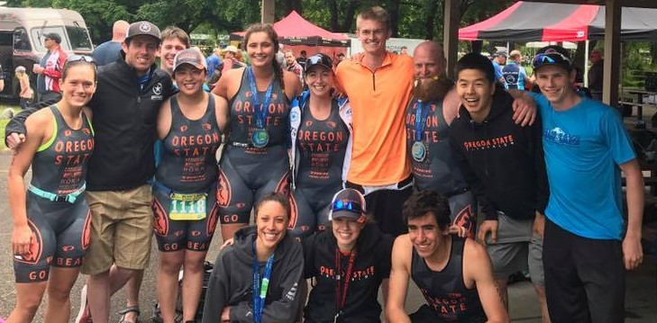

# Final-Project

## Details
Fairly simple layout with drone footage (pg 1), and pictures of racers doing all three portions (pg 2). If I have time to be fancy, I would like to show drone footage of each event if they click on the swim/bike/run picture tiles (on pg 2). I want to introduce more people to triathlon and talk about why I love it so much. So the layout will be pretty simple with stuff to look at. I think the timeline and expanding map will be a nice feature to show the growth of triathlon events all over the world. If I have time, I would like to have a tab that if clicked upon, will show various stories of inspirational triathletes, maybe after pg 4. On the credits page, I will add info if people want to sign up for a race, etc. or maybe have separate tabs for different races in the valley.

### Design Scheme

### Fonts

<h1>Calisto MT</h1>

### Icons
Facebook will be linked to Best in the West Events Page and Instagram will be linked to the OSU Triathlon Club Profile.

### Multimedia
I will add a video from the Triathlon Festival, I just need to get a hold of the original copy. There will be a geojson of the races within the valley and links for each website. And more triathlon photos as well.

